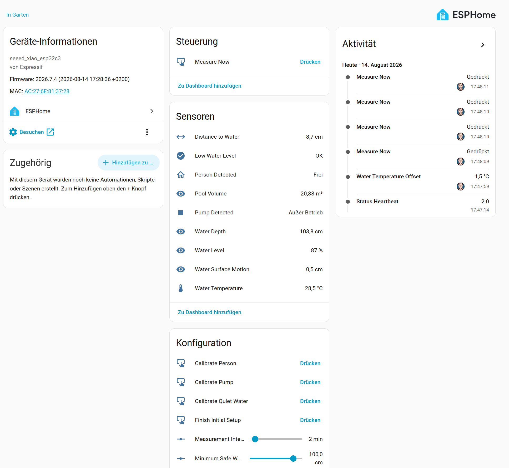
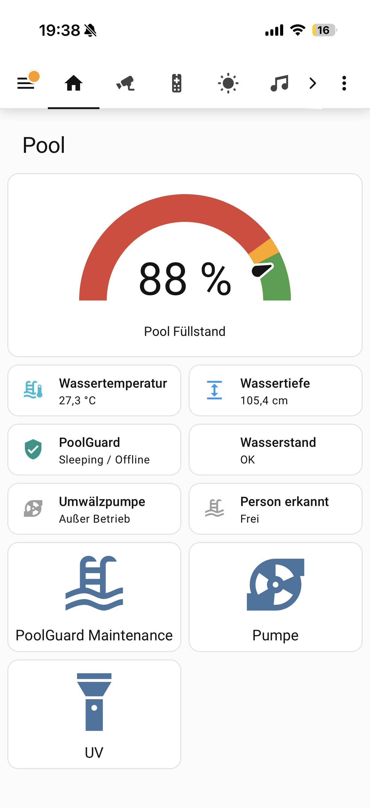
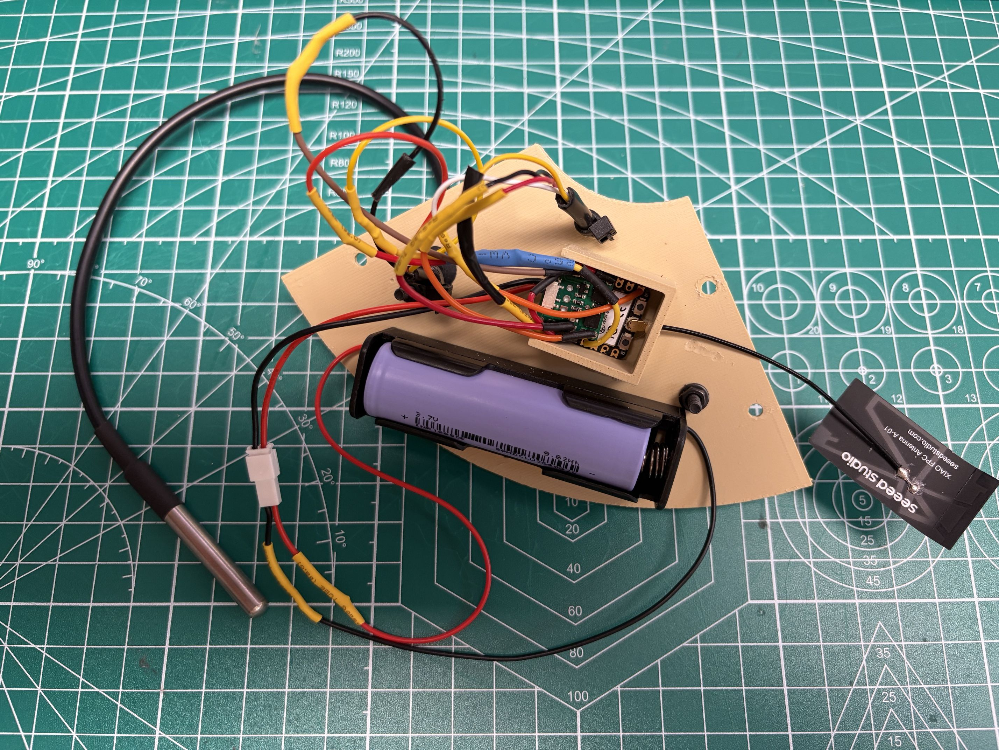
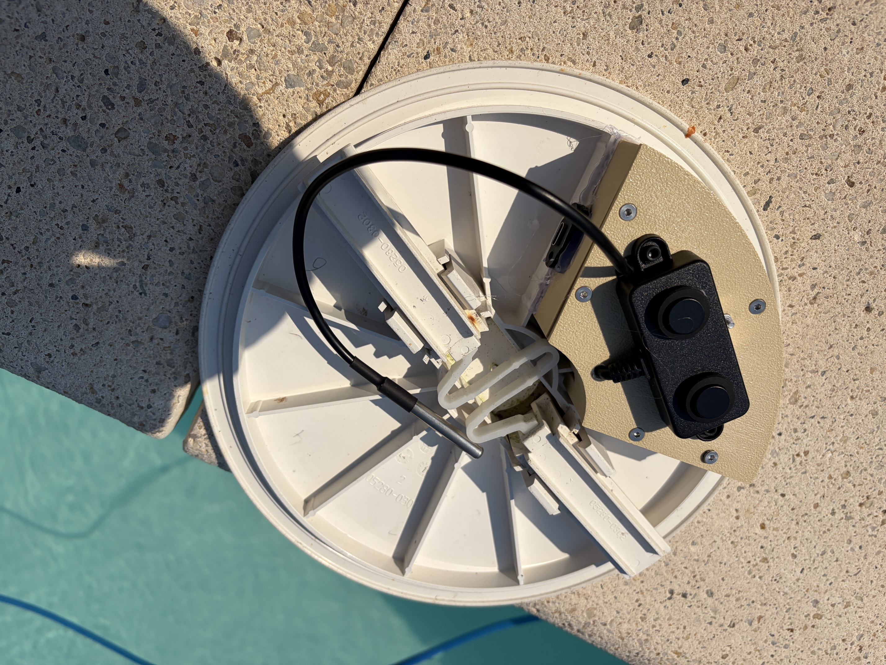

# PoolGuard

**Battery-powered pool skimmer monitor for Home Assistant and ESPHome**

[Deutsch](README_DE.md) · English

PoolGuard is a DIY sensor module designed to fit precisely into the lid of an **AstralPool 17.5 L skimmer** and can be glued in place without drilling the original lid. The module measures the distance to the water surface and derives the current pool-water depth and level. It also monitors pool-water temperature. By analysing movement and short-term fluctuations at the water surface, PoolGuard can additionally estimate whether the circulation pump is running. Significantly stronger and more irregular surface movement can indicate that somebody is currently in the pool. Deep sleep and fully powering down the A02YYUW between checks are intended to make one battery charge last for an entire pool season.

## Home Assistant possibilities

PoolGuard exposes values and states that can be used for automations such as:

- switching a pool heat pump on or off based on water temperature;
- disabling the circulation pump when the water level is too low;
- sending a notification when the minimum safe water depth is crossed;
- operating a UV-C lamp only while circulation is actually detected;
- detecting unusually strong pool activity that can indicate somebody is in the pool;
- displaying current water depth, water-level percentage and estimated pool volume.

> **Name and affiliation:** PoolGuard is an independent open-source DIY project. It is not affiliated with, endorsed by or connected to any company, brand or commercial product using the PoolGuard name.

## Parts

| Part | Purpose | Link |
|---|---|---|
| Seeed Studio XIAO ESP32-C3 | Microcontroller / ESPHome | [Amazon](https://www.amazon.de/dp/B0iQQg2zF) |
| USB-C breakout cable | Power / connection | [Amazon](https://www.amazon.de/dp/B0eO8jr4N) |
| DFRobot A02YYUW | Distance measurement to the water surface | [Amazon](https://www.amazon.de/dp/B0dWRfbC4) |
| Waterproof DS18B20 | Pool-water temperature | [Amazon](https://www.amazon.de/dp/B08FcJbtj) |
| Protected 18650 Li-ion cell | Power supply | – |
| 18650 battery holder | Battery mounting | [Amazon](https://www.amazon.de/dp/B0hraa6X7) |
| **Pololu Mini MOSFET Slide Switch LV #2810** | Fully powers down the A02YYUW during deep sleep | [Pololu](https://www.pololu.com/product/2810) |

> **Affiliate disclosure:** Some product links may be affiliate links. If you purchase through one of them, I may receive a small commission at no additional cost to you.

## A02YYUW power switching and Controlled Mode

The A02YYUW is powered through a **Pololu Mini MOSFET Slide Switch with Reverse Voltage Protection, LV (#2810)**.

```text
XIAO 3.3 V  -------- VIN   Pololu 2810
XIAO GND    -------- GND   Pololu 2810
D2 / GPIO4  -------- ON    Pololu 2810
Pololu VOUT -------- VCC   A02YYUW
A02YYUW GND -------- GND
A02YYUW TX  -------- D7 / GPIO20 (UART RX)
A02YYUW RX  -------- D1 / GPIO3 (control/trigger line)
```

**Important:** PoolGuard uses all four A02YYUW wires. The fourth wire (A02 RX, yellow) is not left unused; it connects to **D1/GPIO3**. PoolGuard uses this line to operate the sensor in UART Controlled Mode and explicitly trigger measurements. A02 TX (white) returns the measurement frames to D7/GPIO20.

Wire colours on the verified build are: A02 red/VCC to Pololu VOUT, black/GND to common ground, white/TX to D7/GPIO20, and yellow/RX control to D1/GPIO3. Pololu ON is connected to D2/GPIO4. DS18B20 Data is connected to D3/GPIO5 with a 4.7 kΩ pull-up to 3.3 V.

- **D2 / GPIO4 HIGH:** A02YYUW powered on
- **D2 / GPIO4 LOW or high-impedance:** A02YYUW powered off
- **D1 / GPIO3:** Controlled-Mode trigger for A02 RX
- during deep sleep the A02YYUW remains unpowered

Set the Pololu's physical slide switch to off so ESPHome can control its ON pin. The DS18B20 data wire uses D3/GPIO5 with a 4.7 kΩ pull-up to 3.3 V.

The DYP UART-Controlled protocol has been successfully verified on the physical PoolGuard. GPIO3 normally stays high. After the Pololu powers the sensor and its startup delay has elapsed, the ESP sends repeated falling edges to A02 RX. Each edge explicitly requests a measurement. PoolGuard then receives the `FF Data_H Data_L Checksum` frame through A02 TX/GPIO20. There are more than 70 ms between triggers; real tests produced approximately 50 valid frames per five-second burst. The A02 is then fully powered down again. The sensor therefore does not transmit continuously and is active only during short measurement windows, which is a key part of the low-power design.

## Measurement and low-power operation

**Measurement Interval** configures the desired time from one normal wake to the next from 1 to 15 minutes; the default is 2 minutes. PoolGuard subtracts the current wake's active runtime from this period before entering deep sleep, so the measurement time is not simply added to the configured interval. Shorter intervals react faster but consume more battery.

Every normal wake keeps Wi-Fi disabled, powers the A02 only for its controlled-UART burst, evaluates the samples locally and switches the A02 off again. **Periodic Report Every** selects a regular report after 1 to 120 wakes and defaults to 30. Thus 2 minutes × 30 wakes is approximately one report per hour. Pump and low-water state changes can still request an immediate report. The first newly detected person/bathing event is also reported immediately; PoolGuard then suppresses **further reports for 180 minutes when the only reason would be another person-state change**. Local measurements and classification continue during this lockout, but Wi-Fi/API are not started again merely because the person state is flapping. The lockout is kept in RTC memory and causes no additional flash writes. Periodic reports and required pump or low-water reports are unaffected. Wi-Fi/API are otherwise used only for Initial Setup or Maintenance.

Both interval numbers use `restore_value` and survive a complete battery disconnect. ESPHome writes them only when the user changes them. Measurements, the normal wake counter and runtime state are not written to flash each wake; the counter and pending reported states remain in RTC memory.

### Home Assistant state and sleep status

Before a connected sleep transition, PoolGuard publishes **PoolGuard Status = Sleeping / Offline** and calls `deep_sleep.enter` directly. It deliberately does not disable Wi-Fi first: ESPHome must close the native API as an expected deep-sleep disconnect. Home Assistant can then keep the last successfully reported measurement values available while the device sleeps.

The status entity reports **Initial Setup**, **Measuring**, **Reporting**, **Maintenance**, or **Sleeping / Offline**. During an ordinary offline wake, Home Assistant cannot see the brief Measuring phase because starting Wi-Fi just to announce it would defeat the low-power design; the retained status therefore remains Sleeping / Offline from HA's perspective. For the same reason there is no misleading firmware `Device Awake` binary sensor. Use HA's integration connectivity for live reachability and PoolGuard Status for the intentional operating state.

<p align="center">
  <br>
  <em>PoolGuard in Home Assistant: Even while <code>Sleeping / Offline</code>, the last successfully transmitted measurements remain available.</em>
</p>

### Lovelace dashboard

<p align="center">
  <br>
  <em>PoolGuard Lovelace dashboard with water level, water temperature, device status, circulation-pump state and person/activity detection.</em>
</p>

**Status Heartbeat** changes only after a complete successful report. Its Home Assistant `last_updated` metadata is the **Last Successful Report** time and shows the age of retained measurements without an ESP timestamp or flash write.

The persistent **Water Temperature Offset** ranges from -5.0 to +5.0 °C in 0.1 °C steps and is saved only when changed. For example, if the DS18B20 reads 25.6 °C while a reference thermometer reads 26.8 °C, set the offset to +1.2 °C; **Water Temperature** then reports 26.8 °C. It survives battery replacement. The offset is applied exactly once to a real temperature conversion; a complete report does not feed the already corrected value through the same filter a second time.

OTA remains available whenever PoolGuard is already online in Initial Setup, Maintenance Mode or a report window. The device does not create additional Wi-Fi connections solely for OTA.

## Example: Home Assistant alerts

PoolGuard can be combined with Home Assistant automations to provide several independent safety and notification functions. Keeping these automations separate makes troubleshooting easier and allows each protection function to be enabled, disabled, or adjusted independently.

The examples below assume the following entities:

- `binary_sensor.poolguard_person_detected`
- `binary_sensor.poolguard_low_water_level`
- `binary_sensor.poolguard_pump_detected`
- `sensor.poolguard_water_depth`
- `sensor.poolguard_water_level`
- `switch.shellyplugmg3_08927254033c`
- `notify.mobile_app_iphone_17_von_tobi`

Replace the notification service and Shelly entity with your own entities if required.

### 1. Person / bathing activity detected

The firmware already rate-limits person-triggered reports. After one reported person/bathing event, further person-only report requests are suppressed for 180 minutes while local measurements continue. This prevents repeated notifications and unnecessary Wi-Fi/API wake-ups caused by fluctuating water movement.

```yaml
alias: PoolGuard – Person detected
description: Critical notification when PoolGuard detects person/bathing activity.
triggers:
  - trigger: state
    entity_id: binary_sensor.poolguard_person_detected
    from: "off"
    to: "on"

conditions: []

actions:
  - action: notify.mobile_app_iphone_17_von_tobi
    data:
      title: "🚨 PoolGuard: Pool activity!"
      message: >-
        PoolGuard detected strong water-surface movement that may indicate
        a person or bathing activity in the pool.
      data:
        push:
          interruption-level: critical

mode: single
```

### 2. Low-water warning

This automation sends an immediate warning when the water level becomes critical. If the low-water condition remains active, the warning is repeated once per hour until the water level returns to normal.

```yaml
alias: PoolGuard – Niedrigwasser Warnung
description: >
  Warnt sofort bei kritischem Wasserstand und anschließend einmal pro Stunde,
  solange der Wasserstand weiterhin kritisch ist.

triggers:
  - trigger: state
    entity_id: binary_sensor.poolguard_low_water_level
    from: "off"
    to: "on"

conditions: []

actions:
  - repeat:
      while:
        - condition: state
          entity_id: binary_sensor.poolguard_low_water_level
          state: "on"

      sequence:
        - action: notify.mobile_app_iphone_17_von_tobi
          data:
            title: "🚨 PoolGuard: Wasserstand kritisch!"
            message: >-
              PoolGuard hat einen kritischen Wasserstand bestätigt.

              Auslösende Wassertiefe:
              {{ states('sensor.poolguard_low_water_trigger_depth') }} cm

              Aktuelle Wassertiefe:
              {{ states('sensor.poolguard_water_depth') }} cm

              Aktueller Füllstand:
              {{ states('sensor.poolguard_water_level') }} %.
            data:
              push:
                interruption-level: critical

        - delay:
            hours: 1

mode: restart
```

### 3. Pump safety shutdown on low water

This automation switches the circulation pump off when PoolGuard reports a critical water level.

It also prevents the pump from being switched back on while the low-water condition remains active. This is useful when the pump is controlled by another schedule or automation that could otherwise start it again.

A critical notification is sent every time the automation actually performs a safety shutdown.

```yaml
alias: PoolGuard – Pump safety shutdown
description: >
  Switch off the pool pump when the water level is critical and prevent
  it from being switched back on while the low-water condition remains active.
  Send a critical notification for every safety shutdown.

triggers:
  - trigger: state
    entity_id: binary_sensor.poolguard_low_water_level
    from: "off"
    to: "on"
    id: low_water

  - trigger: state
    entity_id: switch.shellyplugmg3_08927254033c
    from: "off"
    to: "on"
    id: pump_on

conditions:
  - condition: state
    entity_id: binary_sensor.poolguard_low_water_level
    state: "on"

  - condition: state
    entity_id: switch.shellyplugmg3_08927254033c
    state: "on"

actions:
  - action: switch.turn_off
    target:
      entity_id: switch.shellyplugmg3_08927254033c

  - action: notify.mobile_app_iphone_17_von_tobi
    data:
      title: "🚨 PoolGuard: Pump safety shutdown!"
      message: >-
        The circulation pump was automatically switched off because
        PoolGuard detected a critical water level.

        Water depth:
        {{ states('sensor.poolguard_water_depth') }} cm

        Water level:
        {{ states('sensor.poolguard_water_level') }} %
      data:
        push:
          interruption-level: critical

mode: restart
```

### 4. Pump powered but no normal water movement detected

This automation covers a different failure mode: the Shelly reports that the circulation pump is powered, but PoolGuard does not detect the expected water-surface movement.

This can happen, for example, if a multiport valve is still set to **backwash** or **waste** when a scheduled pump cycle starts. In this situation the pump may remove water from the pool instead of circulating it normally and could eventually run dry.

Because PoolGuard operates in low-power measurement cycles, the automation does not react immediately. The condition must remain present for five minutes before the first warning is sent. This gives PoolGuard enough time for multiple measurement cycles and reduces false alarms.

After the initial warning, another warning is sent every five minutes while the pump remains powered and PoolGuard still detects no normal circulation.

For initial deployment, notification-only operation is recommended. Automatic shutdown can be added later after pump detection has been verified to be reliable under real operating conditions.

```yaml
alias: PoolGuard – Pump on without detected circulation
description: >
  Warn when the pump Shelly is on but PoolGuard does not detect the
  expected circulation movement. Repeat every five minutes while the
  fault condition remains active.

triggers:
  - trigger: template
    value_template: >-
      {{
        is_state('switch.shellyplugmg3_08927254033c', 'on')
        and
        is_state('binary_sensor.poolguard_pump_detected', 'off')
      }}
    for:
      minutes: 5

conditions: []

actions:
  - repeat:
      while:
        - condition: state
          entity_id: switch.shellyplugmg3_08927254033c
          state: "on"

        - condition: state
          entity_id: binary_sensor.poolguard_pump_detected
          state: "off"

      sequence:
        - action: notify.mobile_app_iphone_17_von_tobi
          data:
            title: "🚨 PoolGuard: Pump running without circulation!"
            message: >-
              The pump Shelly is switched on, but PoolGuard does not detect
              the expected water movement from normal circulation.

              Please check the pool system immediately.

              Possible causes:
              - multiport valve still set to backwash/waste
              - missing water flow
              - blocked circulation
              - pump problem
            data:
              push:
                interruption-level: critical

        - delay:
            minutes: 5

mode: restart
```

> **Important:** These automations are examples only. Entity IDs, notification services, delay times and shutdown behaviour must be adapted to the actual installation. Pump and person/activity detection are based on water-surface motion and must not be treated as a certified safety system.

## Maintenance Mode

Create a persistent Home Assistant helper named **PoolGuard Maintenance Mode** with entity ID `input_boolean.poolguard_maintenance_mode` (Settings → Devices & services → Helpers → Create helper → Toggle). The helper, rather than an ESPHome template switch, owns the requested state so an ON command is retained while PoolGuard is asleep and offline.

Turning the helper on is not immediate while PoolGuard sleeps. PoolGuard does not connect to Wi-Fi during each local measurement. It receives the retained request the next time the existing event-driven or periodic reporting logic connects to the Home Assistant API. With the defaults of 2 minutes and 30 wakes, the worst-case delay is approximately one hour; a state-change report can activate it earlier. **PoolGuard Status = Maintenance** confirms that the request has actually reached the device.

While Maintenance Mode is active, PoolGuard stays awake with Wi-Fi/API connected. It performs a powered A02 burst and evaluates water level, pump/activity and person/activity approximately every 5 seconds. Water temperature updates every 30 seconds. The A02 is switched off between bursts. Leaving this mode enabled greatly reduces battery life. Maintenance is really active when **PoolGuard Status** shows Maintenance, the live ESPHome log remains connected and repeated A02 measurement bursts continue to appear in the log. This makes the mode particularly suitable for OTA work and recalibration.

Turn the helper off to leave Maintenance Mode immediately. PoolGuard stops live measurements, switches the A02 off, performs final temperature housekeeping, and returns to its normal deep-sleep cycle without rebooting. The local active flag is intentionally not restored after an unexpected reset: battery-saving operation is the fail-safe default, while the retained HA helper request can be accepted again at a later normal API connection.

Maintenance Mode is a runtime Home Assistant control and does not require reflashing. It remains distinct from Initial Setup Mode, and checking its helper does not add Wi-Fi connections to the local measurement cycle. OTA is available while Maintenance is active; turn the helper back off after OTA or calibration so PoolGuard returns to deep sleep and battery operation.

## Initial Setup Mode

On the first boot in factory state, PoolGuard automatically enters Initial Setup Mode. A flash-backed `initial_setup_completed` flag defaults to false, so Wi-Fi and the Home Assistant API remain enabled and deep sleep is prevented. The A02 stays powered off while idle; it is powered only for an explicit measurement or calibration action. The DS18B20 remains available.

Commissioning requires only one firmware flash:

1. Flash PoolGuard and add it to Home Assistant.
2. Set the water-level reference and minimum safe water depth.
3. Calibrate Quiet Water, Pump and Person if possible.
4. Press **Finish Initial Setup**.

PoolGuard requires a valid water-level reference before it accepts the finish command. Incomplete motion calibration is allowed; a warning is logged and the fallback thresholds remain active. The completion flag is then saved to flash, the A02 is switched off, and normal battery-saving operation begins. Every later power-up, reset and deep-sleep wake starts directly in normal mode. No second flash is required.

To commission the device again, press **Reset Initial Setup** twice within 10 seconds. This confirmation protects against an accidental press. PoolGuard immediately clears the persistent flag, stays awake with Wi-Fi/API enabled, and keeps the A02 off until a measurement or calibration is requested. Existing calibration values are not erased automatically.

## Water-level reference calibration

PoolGuard no longer requires separate "empty" and "full" distance calibration points. **One known real water depth is enough.**

During the automatically entered Initial Setup Mode:

1. Measure the **actual current water depth** in the pool in centimetres.
2. Enter it in **Reference Water Depth**.
3. Press **Measure Now** and check that the A02 distance is plausible.
4. Press **Set Water Level Reference** while the water remains at that level.
5. Set **Minimum Safe Water Depth** to the lowest real depth at which the skimmer can still supply the circulation pump safely.
6. With the pump off, nobody in the pool and the water as calm as possible, press **Calibrate Quiet Water**.
7. Run the pump with nobody in the pool and press **Calibrate Pump**.
8. Create typical swimming/bathing movement and press **Calibrate Person**.
9. Review the three motion profiles and automatically learned thresholds.
10. Press **Finish Initial Setup**.

From then on, PoolGuard calculates the current depth from the change in A02 distance. The distance from the sensor to the pool bottom does not have to be measured separately.

The calculation has been tested on the real pool: a reference depth of 105.5 cm subsequently produced approximately 105.4 cm. Water reference, minimum safe depth, all three motion profiles, learned thresholds and temperature offset are flash-persistent and survive battery replacement.

The default geometry in the YAML is a round pool with **5.0 m diameter** and **120 cm maximum depth**. `Water Level` is calculated as a percentage of that configured maximum depth. `Pool Volume` assumes a cylindrical pool and uses the current measured water depth. With the default geometry, 120 cm corresponds to approximately **23.56 m³**. For another pool, change `pool_diameter_m` and `pool_max_depth_cm` in the YAML. Pools with non-cylindrical bottoms will only get an approximate volume.

## Guided motion calibration

Pump and pool-activity detection depend heavily on the actual skimmer, pump flow, water level and pool geometry. PoolGuard therefore includes guided calibration instead of relying only on fixed thresholds.

In Initial Setup Mode, run these three buttons in order if possible:

1. **Calibrate Quiet Water** – pump off and nobody in the pool.
2. **Calibrate Pump** – circulation pump running, nobody in the pool.
3. **Calibrate Person** – normal swimming/bathing movement in the pool.

Each phase measures about 60 seconds and stores the median motion profile. Motion is evaluated from a trimmed sample span so single outliers or splashes have less influence than a raw min/max range. If the profiles are clearly ordered `quiet < pump < person`, PoolGuard automatically calculates the pump and person/activity thresholds. If they overlap, the previous or fallback thresholds remain active.

The three values describe increasing water-surface movement: Quiet Motion is the baseline noise, Pump Motion is normal circulation, and Person Motion is typical bathing activity. For example, profiles of Quiet 0.50 cm, Pump 0.90 cm and Person 1.45 cm are correctly ordered. PoolGuard places the learned pump threshold halfway between Quiet and Pump (0.70 cm) and the person threshold halfway between Pump and Person (about 1.18 cm).

### Recalibrating individual profiles later

A complete recalibration is not required when only one real-world operating condition has changed. The three profiles can be measured **individually**. Turn on the Maintenance helper and wait until **PoolGuard Status = Maintenance**, then run only the calibration you want to update.

Example: if the running circulation pump is incorrectly classified as a person/bathing activity, leave the pump running under normal real conditions and run **Calibrate Pump** again. Quiet Water and Person do not automatically need to be recalibrated. Afterwards review `Calibration Pump Motion`, `Calibration Person Motion`, `Active Pump Motion Threshold` and `Active Person Motion Threshold`. If the new pump profile reaches or exceeds the person profile, the motion patterns overlap; in that case the person calibration should also be reviewed under realistic conditions.

**Reset Motion Calibration** is not required for normal recalibration. Use it only when you intentionally want to discard all stored motion profiles. After recalibration, turn the Maintenance helper off so PoolGuard returns to normal deep-sleep operation.

Motion calibration is optional for finishing initial setup. If it cannot be completed, PoolGuard logs a warning and continues with its fallback thresholds. After calibration, press **Finish Initial Setup** to begin normal battery-saving operation.

> **Important:** PoolGuard does not detect a person directly. It classifies water-surface motion. Pump/activity detection is therefore an experimental indication and must not be used as a safety system or substitute for pool supervision.

## Mechanical concept

The housing body sits inside the skimmer and is fixed to the side ribs using suitable neutral-curing silicone. The original centre rib remains intact. The body is intentionally **slightly sloped towards the inside of the skimmer**, so any water that reaches the housing can drain back into the skimmer instead of collecting on the body. The removable lower lid carries the electronics:

- battery holder and ESP on the dry/internal side;
- A02YYUW on the water-facing side;
- feed-through for the DS18B20 cable.

The current printable files are available in [`3D-Files/`](3D-Files/). I use a Bambu Lab A1 Mini.

<p align="center">
  <br>
  <em>PoolGuard housing concept for the skimmer lid and removable electronics carrier.</em>
</p>

## Moisture protection and silica gel

PoolGuard sits only a few centimetres above the water surface. Even without direct water ingress, high humidity and temperature changes can cause condensation. A small closed **silica-gel desiccant sachet** inside the electronics compartment is therefore useful as an additional moisture buffer. For the small PoolGuard enclosure, roughly **5–10 g** in total is a practical starting point if the sachet can be secured without stressing components or electrical contacts.

Silica gel is not chemically "used up", but it gradually becomes saturated with water and then loses its effectiveness. Regenerable sachets, ideally with a humidity indicator, can be inspected during seasonal maintenance and dried/regenerated according to the manufacturer's instructions or replaced. There is no honest fixed lifetime in days for PoolGuard: it depends heavily on how open the enclosure is to humid outside air, pool and air temperature, and day/night temperature swings.

Do not use loose granules and **do not use table salt**. Silica gel also does not replace protection against direct splashes or dripping water. The complete electronics enclosure should not simply be covered in silicone or fully potted in epoxy; obvious ingress paths and cable entries can instead be sealed selectively.

More detail: [Moisture, condensation and silica gel](docs/ENVIRONMENT.md).

## Final assembly

<table>
  <tr>
    <td width="50%" align="center"></td>
    <td width="50%" align="center"></td>
  </tr>
  <tr>
    <td align="center"><em>Wired electronics carrier with 18650 battery, XIAO controller, A02 and DS18B20.</em></td>
    <td align="center"><em>Sensor side of the completed carrier fitted to the original skimmer lid.</em></td>
  </tr>
</table>

## Quick start

1. Download and print the current files from `3D-Files/`.
2. Use `esphome/secrets.example.yaml` as a template for your own ESPHome secrets. PoolGuard uses the device-specific `poolguard_api_encryption_key` and `poolguard_ota_password` names; Wi-Fi secrets may be shared.
3. Review pins, pool geometry and calibration values in `esphome/poolguard.yaml`.
4. Flash the XIAO ESP32-C3 via USB.
5. On the automatic first boot, add PoolGuard to Home Assistant.
6. Measure the real water depth, enter **Reference Water Depth** and press **Set Water Level Reference**.
7. Set **Minimum Safe Water Depth** for the real skimmer/pump installation.
8. Run the quiet-water, pump and person/activity calibration if possible.
9. Press **Finish Initial Setup**. PoolGuard stores completion and starts normal low-power operation; no second flash is required.

## Safety

- Use a protected, reputable 18650 cell.
- Do not short, crush, reverse or charge the cell unattended.
- Keep the electronics protected from condensation and splash water.
- Use the Pololu 2810 to fully power down the A02YYUW during deep sleep.
- Treat pump and person/activity detection as indications only, never as the sole basis for a safety-critical shutdown or monitoring function.
- This is an experimental DIY project. Build, install and operate it at your own risk.

## Support

<a href="https://paypal.me/toor0001/5"></a>

## License

Software and documentation are released under the MIT License. CAD files are currently prototype files and may receive a separate hardware license before the first stable release.

## Development Note

This project was created as part of a collaborative **vibe-coding workflow** with **ChatGPT** and **OpenAI Codex**. Both tools were used for code generation, reviews, troubleshooting and documentation.

Hardware assembly, integration decisions, practical testing and final responsibility for the project remain with the project operator.
