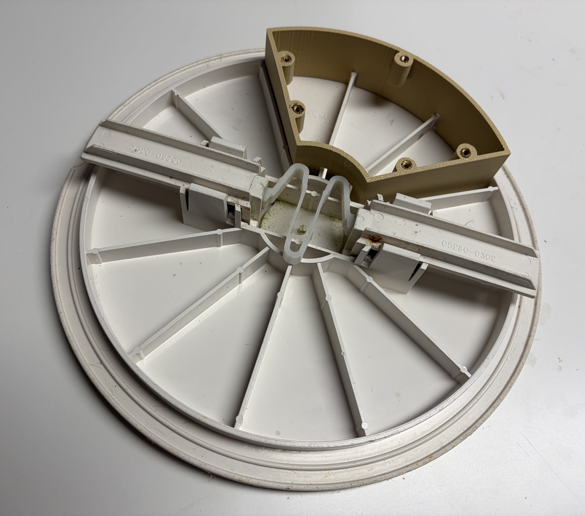

# PoolGuard

**Battery-powered pool skimmer monitor for Home Assistant and ESPHome**

[Deutsch](README_DE.md) · English

PoolGuard is a DIY sensor module for an **AstralPool 17.5 L skimmer**. It measures water level and water temperature and also analyses movement of the water surface. From this, PoolGuard can estimate whether the circulation pump is running and whether unusually strong surface movement indicates swimming/bathing activity.

The design focuses on low power consumption: the XIAO ESP32-C3 wakes only briefly during normal operation, the A02YYUW is fully power-switched by a Pololu MOSFET, and Wi-Fi is used only when needed.

> **Project status:** prototype / work in progress. Pump and activity detection must be tested and calibrated on the real pool.

> **Important:** PoolGuard does not directly detect a person. It only classifies water-surface motion and must never be used as a safety system or substitute for pool supervision.

## Features

- A02YYUW distance measurement to the water surface
- real water depth from a single reference measurement
- water-level percentage
- estimated pool volume
- DS18B20 water temperature
- low-water warning with hysteresis
- circulation-pump detection from surface motion
- experimental swimming/person-activity indication
- guided quiet/pump/person motion calibration
- persistent calibration values
- automatic Initial Setup Mode for commissioning
- Home Assistant Maintenance Mode
- event-driven Wi-Fi/API reporting
- deep sleep and complete A02YYUW power-off
- OTA updates while awake / in maintenance mode

## Home Assistant possibilities

PoolGuard values can be used to control a pool heat pump from water temperature, stop the circulation pump at unsafe water level, send low-water notifications, operate a UV-C lamp only while circulation is detected, or display water depth, percentage and estimated volume in a dashboard.

## Hardware

| Part | Purpose | Link |
|---|---|---|
| Seeed Studio XIAO ESP32-C3 | Microcontroller / ESPHome | [Amazon](https://link.amazon/B0iQQg2zF) |
| USB-C breakout cable | Power / connection | [Amazon](https://link.amazon/B0eO8jr4N) |
| DFRobot A02YYUW | Distance and surface-motion measurement | [Amazon](https://link.amazon/B0dWRfbC4) |
| Waterproof DS18B20 | Water temperature | [Amazon](https://link.amazon/B08FcJbtj) |
| Protected 18650 Li-ion cell | Power supply | – |
| 18650 battery holder | Battery mounting | [Amazon](https://link.amazon/B0hraa6X7) |
| **Pololu Mini MOSFET Slide Switch LV #2810** | Fully switches A02YYUW power | [Pololu](https://www.pololu.com/product/2810) |
| External 2.4 GHz Wi-Fi antenna | Improved Wi-Fi reception | – |

> **Affiliate disclosure:** Some product links may be affiliate links. If you purchase through one of them, I may receive a small commission at no additional cost to you.

## Pin assignment

The current firmware deliberately avoids ESP32-C3 strapping pins GPIO2, GPIO8 and GPIO9.

| Function | XIAO ESP32-C3 |
|---|---|
| Pololu ON | D2 / GPIO4 |
| A02YYUW TX → ESP RX | D7 / GPIO20 |
| DS18B20 DATA | D3 / GPIO5 |
| GPIO3 | unused/free |

The DS18B20 requires a **4.7 kΩ pull-up between DATA and 3.3 V**.

### A02YYUW through Pololu 2810

```text
XIAO 3.3 V  -------- VIN   Pololu 2810
XIAO GND    -------- GND   Pololu 2810
GPIO4 / D2  -------- ON    Pololu 2810
Pololu VOUT -------- VCC   A02YYUW
A02YYUW GND -------- GND
A02YYUW TX  -------- GPIO20 / D7
A02YYUW RX  -------- leave unconnected
```

Pololu `ON` is active-high. During deep sleep the GPIO is not held active and the A02YYUW remains unpowered.

## Normal operation and power saving

Defaults are:

```yaml
sleep_duration: 55s
detection_burst_duration: 5s
status_every_wakes: "30"
```

After commissioning, PoolGuard wakes roughly once per minute. The A02YYUW is powered, samples are collected during the measurement burst, and the sensor is switched off again immediately afterwards. Normal local checks do not require a permanent Wi-Fi connection.

PoolGuard connects to Wi-Fi/Home Assistant when a relevant state changes – pump, bathing activity or low water – or when the periodic status report is due. By default the periodic report is due after about 30 wake cycles and also updates water temperature.

Last states and counters are retained in ESP32 RTC memory across deep sleep. If Wi-Fi/API transmission fails, a state change remains pending and is retried on a later wake.

### Measurement burst vs. battery life

`detection_burst_duration` is the main tuning parameter for the trade-off between detection robustness and battery life:

```yaml
detection_burst_duration: 5s
```

A longer burst supplies more A02 samples and can improve motion classification, but keeps the ESP and sensor active for longer. **Five seconds is a conservative commissioning/testing value.** After real-world validation, values such as **2 s or 1.5 s** can be tested and may substantially improve battery life.

The firmware requires at least five valid A02 frames for a valid normal cycle, so shorter bursts should only be used after practical testing.

Guided motion calibration is independent of this value and continues to use its own 5-second windows.

## Robust A02 processing

The A02YYUW sends UART frames with a checksum. PoolGuard accepts only valid frames and plausible distances from 30 to 4500 mm. A normal cycle requires at least five valid frames.

Distance is calculated from the **median** of the collected samples. Surface motion is calculated from approximately the 10th-to-90th-percentile span rather than raw min/max values, reducing the influence of isolated outliers and splashes.

## Water-level calculation

PoolGuard does not require separate empty/full calibration points. One known real water depth is sufficient.

During reference calibration PoolGuard stores both the current A02 distance and the actual measured water depth. Future water depth follows directly from changes in sensor-to-water distance.

Default geometry:

```yaml
pool_diameter_m: "5.0"
pool_max_depth_cm: "120.0"
```

`Water Level` is current depth relative to configured maximum depth. `Pool Volume` assumes a cylindrical pool and uses `π × radius² × current depth`. At 5.0 m diameter and 120 cm depth this is approximately **23.56 m³**.

Other pools should adjust these values. Non-cylindrical bottoms only receive an approximate volume.

## Low-water detection

`Minimum Safe Water Depth` is editable in Home Assistant and must be determined on the real skimmer. A 1 cm hysteresis is configured by default:

```yaml
low_water_hysteresis_cm: "1.0"
```

`Low Water Level` becomes active when the minimum is reached or crossed and only clears after water rises to minimum + hysteresis. This prevents rapid toggling around the threshold.

## Initial Setup Mode

A new or reset device automatically starts in **Initial Setup Mode**. There is no compile-time calibration switch and no second firmware flash is required.

`initial_setup_completed` is stored persistently in flash and survives deep sleep, reset and complete power loss.

While setup is incomplete:

- deep sleep is prevented;
- Wi-Fi/API remain available;
- A02YYUW stays powered off while idle;
- measurements happen only on request or during calibration;
- water temperature is periodically refreshed while awake.

### First commissioning

1. Flash PoolGuard once via USB.
2. The device automatically remains online in Initial Setup Mode.
3. Measure the actual current pool-water depth in cm.
4. Enter it as **Reference Water Depth**.
5. Press **Set Water Level Reference**.
6. Set **Minimum Safe Water Depth** for the real skimmer.
7. Optionally calibrate the three motion profiles.
8. Press **Finish Initial Setup**.

PoolGuard then stores setup completion, disables Wi-Fi and enters normal deep-sleep operation.

`Finish Initial Setup` is refused while motion calibration is running or if no valid water reference exists. Complete motion calibration is optional; fallback thresholds remain available.

### Resetting Initial Setup

**Reset Initial Setup** uses a two-press safeguard. Press it twice within 10 seconds to return the device to awake setup mode.

## Guided motion calibration

Three profiles can be learned:

1. **Calibrate Quiet Water** – pump off, nobody in the pool.
2. **Calibrate Pump** – circulation pump running, nobody in the pool.
3. **Calibrate Person** – representative swimming/bathing movement.

By default each profile uses **12 × 5-second windows**, about 60 seconds. Each window produces a robust motion value and the median of valid windows becomes the stored profile.

If profiles are clearly ordered `quiet < pump < person`, PoolGuard automatically learns thresholds halfway between the profiles. If they overlap or are out of order, previous or fallback thresholds remain active.

Fallbacks:

```yaml
pump_motion_threshold_cm: "1.5"
person_motion_threshold_cm: "3.0"
```

**Reset Motion Calibration** clears learned profiles and returns to fallback thresholds.

## State stabilisation

Confirmation cycles reduce unwanted toggling from single measurement bursts. By default pump motion must be confirmed in two cycles. Person/activity indication switches on faster and requires two quiet cycles to clear.

While person-like motion is active, the pump state is deliberately held so strong bathing motion is not misinterpreted as a pump-state change.

## Maintenance Mode

Create a persistent Home Assistant helper with exactly this entity ID:

```text
input_boolean.poolguard_maintenance_mode
```

PoolGuard does **not** wake Wi-Fi every minute just to check this helper. Home Assistant retains the request and PoolGuard receives it during the next API connection that would have happened anyway. This preserves battery life, although activation may therefore be delayed until the next regular status/event report.

While Maintenance Mode is active, PoolGuard stays awake and continuously performs measurement bursts. Switching the helper off ends maintenance and, if Initial Setup has already been completed, returns PoolGuard to deep sleep.

Because Home Assistant stores the requested state, Maintenance Mode can be requested while PoolGuard is asleep.

## OTA updates

ESPHome OTA is configured. For reliable OTA updates, first put PoolGuard into Maintenance Mode so it remains awake and reachable. OTA is also available during Initial Setup Mode because the device stays online there.

## Home Assistant entities

Important values/states include:

- **Water Temperature**
- **Distance to Water**
- **Water Depth**
- **Water Level**
- **Pool Volume**
- **Water Surface Motion**
- **Pump Detected**
- **Person Detected**
- **Low Water Level**
- **WiFi Signal**
- **Calibration Status**

Diagnostic entities expose the three learned motion profiles and the currently active pump/person thresholds.

Configuration and controls include **Reference Water Depth**, **Minimum Safe Water Depth**, **Measure Now**, water-reference calibration, the three motion-calibration buttons, **Reset Motion Calibration**, **Finish Initial Setup**, and **Reset Initial Setup**.

## Mechanical concept

The housing body sits inside the skimmer and is fixed to the side ribs using suitable neutral-curing silicone. The original centre rib remains intact. The body is slightly sloped toward the skimmer so water can drain back. The removable lid carries the battery, XIAO ESP32-C3 and electronics; the A02YYUW and DS18B20 monitor water surface and temperature. An external Wi-Fi antenna can be positioned close to the plastic skimmer lid.

Current printable files are available in [`3D-Files/`](3D-Files/). I use a Bambu Lab A1 Mini.

<p align="center">
  
</p>

## Safety

- Use a protected, reputable 18650 cell.
- Do not short, crush, reverse or charge the cell unattended.
- Keep electronics protected from condensation and splash water.
- Fully switch the A02YYUW off through the Pololu during deep sleep.
- Never use pump/person/activity detection as the sole basis for safety-critical monitoring or shutdown.

## Support

<a href="https://paypal.me/toor0001/5"></a>

## License

Software and documentation are released under the MIT License. CAD files are currently prototypes and may receive a separate hardware license before the first stable release.

## Development Note

This project was created as part of a collaborative **vibe-coding workflow** with **ChatGPT** and **OpenAI Codex**. Both tools were used for code generation, reviews, troubleshooting and documentation.

Hardware assembly, integration decisions, practical testing and final responsibility for the project remain with the project operator.
